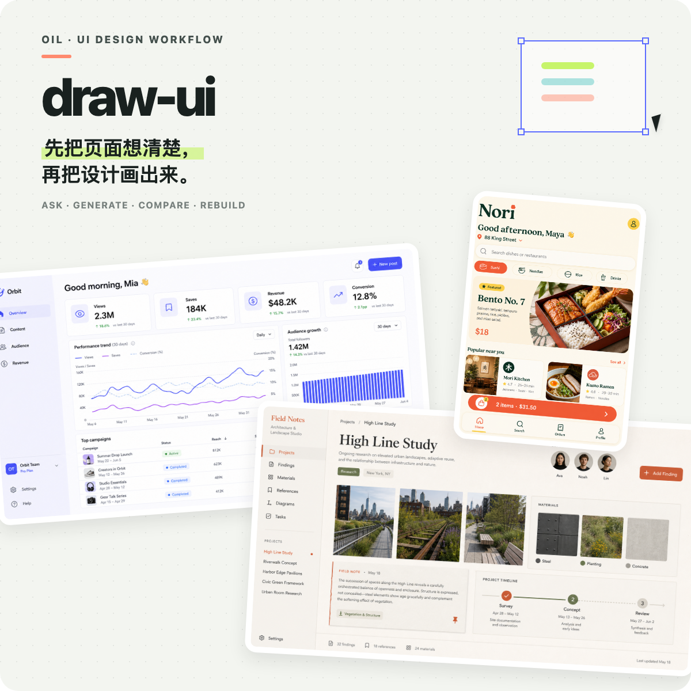
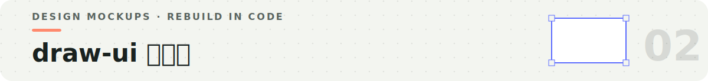
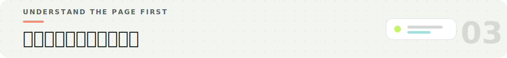
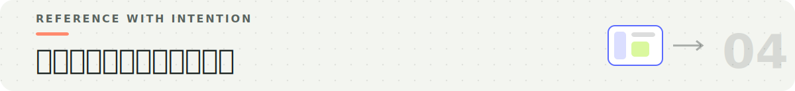
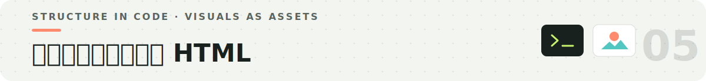
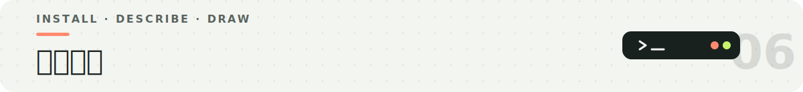

<p align="center">
  
</p>

<p align="center">
  
</p>

`draw-ui` 是一个给 Agent 使用的 UI 设计 Skill。它可以把一段页面需求变成完整的 UI 设计稿，也可以把已有截图或生成图还原成可以运行的 HTML/CSS。

上面的三张页面都来自 `draw-ui` 的真实生成流程：一张信息密集的分析后台、一张温暖的建筑研究工作台，以及一个手机订餐页面。页面类型和风格可以不同，但开始方式是一样的——先理解页面要解决什么，再决定怎么画。

| 我们提供 | draw-ui 负责 | 最后得到 |
| --- | --- | --- |
| 页面目标、真实内容、现有截图和不能改动的区域 | 梳理需求、选择参考图策略、组织提示词并生成设计 | 一张或一组 UI 设计稿 |
| 已确认的设计稿或产品截图 | 拆分代码与图片素材，构建页面并反复对照 | 可以运行的 HTML/CSS 页面 |

默认优先使用 Agent 当前内置的图片生成能力。只有环境里没有内置工具、明确需要 ZenMux，或需要脚本固定本地输出路径时，才会使用仓库里的生成脚本。

<p align="center">
  
</p>

如果我们只说“设计一个 Dashboard”，模型只能自己猜业务，最后很可能画得漂亮，却不是我们需要的页面。开始之前，`draw-ui` 会先确认三件事：

1. 这是哪个页面，最核心的功能是什么？
2. 有没有现有 App 截图或设计稿可以参考？
3. 截图里有没有不能改动的区域，例如侧边栏或顶部导航？

信息已经足够清楚时会直接开始，不会为了流程重复提问。

提示词主要有两种写法：

| 写法 | 怎么写 | 更适合 |
| --- | --- | --- |
| 类比法 | 说明这个工具像什么，例如“像乐谱一样解码一条热门视频” | 需要新鲜设计方向、希望模型发挥的时候 |
| 清单法 | 列出页面里真实存在的信息，例如用户名、30 天趋势、Campaign 状态和触达数 | 业务信息必须准确、页面需要稳定落地的时候 |

几条简单规则会明显影响结果：使用真实示例数据，不写 placeholder；颜色使用 HEX；不要把像素、列数和间距写得太死；提示词尽量控制在 800 字以内。

<p align="center">
  
</p>

参考图里出现的内容，模型都会倾向于模仿，包括我们原本不想让它照搬的部分。因此参考图不是越完整越好，而是要根据目的来选。

| 现在有什么 | 怎么做 | 会得到什么 |
| --- | --- | --- |
| 没有截图，只想探索 | 不传参考图 | 模型可以自由决定整套界面 |
| 想保留导航或侧边栏 | 使用纯净边框图：保留固定区域，把内容区清空 | 外框保持一致，内容区仍有设计空间 |
| 需要整体风格准确对齐 | 使用完整截图，并明确哪些区域不能改 | 风格最接近原页面，但内容布局也更容易被模仿 |

如果要生成多张视觉一致的页面，会先确认第一张，再把它作为下一张的参考，逐张完成。这样比同时生成多张更容易保持导航、字体和组件一致。

<p align="center">
  
</p>

还原设计稿不是把整张截图铺成网页背景。`draw-ui` 会把页面拆成代码和图片素材两部分：

| 用代码完成 | 保留或重新生成图片素材 |
| --- | --- |
| 页面布局、卡片、文字、按钮、表格、筛选器、普通线性图标 | Logo、品牌符号、复杂插画、照片、3D 或玻璃质感、难以用 CSS 准确还原的视觉效果 |

```text
设计稿或截图
  → 判断页面结构
  → 整理需要单独生成的素材
  → 构建 HTML/CSS
  → 浏览器截图
  → 与原图对照并修正
```

Logo、小号深色图标和大幅彩色插画不会混在同一张素材板里。不同素材使用不同的生成与抠图方式，避免白边、绿边和模糊文字进入最终页面。

<p align="center">
  
</p>

**方式一 · 执行命令**

```bash
npx skills add oil-oil/draw-ui
```

**方式二 · 直接交给 Agent**

```text
请安装这个 Skill：https://github.com/oil-oil/draw-ui
```

安装完成后，可以直接描述页面：

```text
[$draw-ui] 帮我设计一个创作者数据分析页面，包含 30 天趋势、热门内容和收入数据。
```

也可以提供截图，让它还原：

```text
[$draw-ui] 把这张设计稿还原成 HTML/CSS，侧边栏保持不变，先告诉我哪些部分需要单独准备图片素材。
```

<details>
<summary><strong>脚本调用与比例选项</strong></summary>

没有内置图片工具，或者需要固定本地输出路径时，可以使用：

```bash
# 不使用参考图
scripts/ask_draw.sh --type wide --name "dashboard" --prompt "..."

# 使用参考图
scripts/ask_draw.sh \
  --frame /path/to/reference.png \
  --type wide \
  --name "dashboard" \
  --prompt "..."
```

| `--type` | 比例 | 适合 |
| --- | --- | --- |
| `wide` | 16:9 | 桌面应用和网站页面 |
| `classic` | 4:3 | Dashboard 和信息密集界面 |
| `square` | 1:1 | 卡片、弹窗和局部组件 |
| `portrait` | 3:4 | 手机页面 |

脚本使用 ZenMux。API Key 可以放在 `ZENMUX_API_KEY`、项目的 `.env.local`，或 `~/.config/see/api_key`。

</details>

## License

MIT
