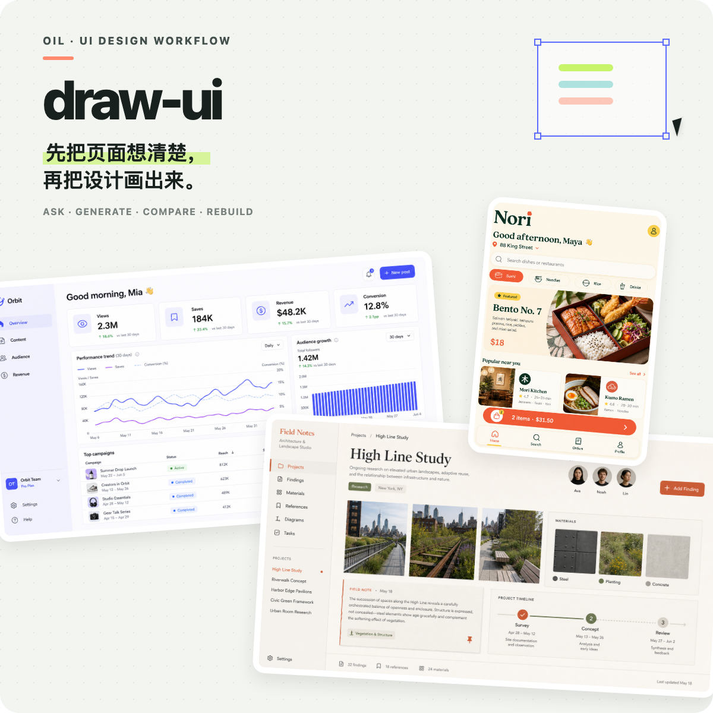
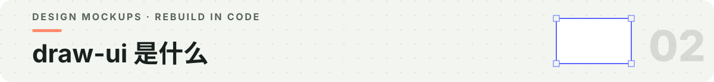
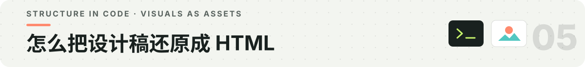
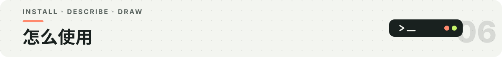
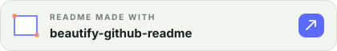

<p align="center">
  
</p>

<p align="center">
  
</p>

设计 App、后台、游戏界面和完整网站落地页，生成 UI 设计稿，并按需还原成可运行页面或小程序。

上面的三张页面都来自 `draw-ui` 的真实生成流程：一张信息密集的分析后台、一张温暖的建筑研究工作台，以及一个手机订餐页面。页面类型和风格可以不同，但开始方式是一样的——先理解页面要解决什么，再决定怎么画。示例用于展示视觉方向，是否适合实际产品还要检查组件一致性、信息密度、素材边界和响应式。

| 我们提供 | draw-ui 负责 | 最后得到 |
| --- | --- | --- |
| 页面目标、真实内容、现有截图和不能改动的区域 | 梳理需求、选择参考图策略、组织提示词并生成设计 | 一张或一组 UI 设计稿 |
| 已确认的设计稿或产品截图 | 拆分代码与图片素材，构建页面并反复对照 | 可以运行的 HTML/CSS 页面或微信小程序页面 |

默认使用 Agent 内置生图能力，无需额外 API Key。指定保存目录时，生成后复制图片即可。外部 API 是用户明确选择后才启用的可选路径；内置工具不可用时会先说明，不自动切换收费服务。

<p align="center">
  
</p>

如果我们只说“设计一个 Dashboard”，模型只能自己猜业务，最后很可能画得漂亮，却不是我们需要的页面。开始之前，`draw-ui` 会先确认三件事：

1. 这是哪个页面，最核心的功能是什么？
2. 有没有现有 App 截图或设计稿可以参考？
3. 截图里有没有不能改动的区域，例如侧边栏或顶部导航？

信息已经足够清楚时会直接开始，不会为了流程重复提问。

默认先确定页面任务与视觉构思，再组织内容、字体、组件和素材边界。各类页面都要有与自身内容相关的视觉重点和阅读节奏；网格、间距与控件尺寸用于支撑它，不能取代设计。特殊裁切、大小对比和适度重叠可以保留，只要有清楚的实现方式；纸纹和装饰不作为缺少设计构思时的补丁。

官网和落地页默认生成从导航到页脚的完整纵向长页，保持桌面布局宽度。工具不能直接输出清晰长图时，按区块分段生成，再检查并组装为一张完整预览。只有明确要求首屏时才只做首屏。

业务完整与视觉质量分别检查：内容齐全不代表设计出色，只有换色或换字也不代表解决了平庸。构思、信息主次、字体与组件细节需要形成一致表达；不承诺每个模型一次生成都成功。

生成图片不代表交互和响应式已经实现。交付包含设计稿、简短实现说明和待验证项；正式还原时优先组件与可编辑文字，只有摄影、插画等视觉内容使用独立素材。

<p align="center">
  
</p>

参考图帮助表达字体、比例、留白和组件细节，也可能带入无关布局。因此先说明要借鉴的设计关系、要保留的区域和需重组的业务内容。需要视觉对齐时核验模型与接口的图片输入能力，不把文字转述当作已经传图。

| 现在有什么 | 怎么做 | 会得到什么 |
| --- | --- | --- |
| 没有截图，只想探索 | 不传参考图 | 模型可以自由决定整套界面 |
| 想保留导航或侧边栏 | 使用纯净边框图：保留固定区域，把内容区清空 | 外框保持一致，内容区仍有设计空间 |
| 借鉴优秀设计风格 | 输入参考图，提取字体、比例、色面与细节关系 | 按当前业务重组的新设计 |
| 需要精准还原 | 使用完整截图，并明确固定区域 | 尽量保持原页面的内容与样式 |

多张页面或交互状态共享一张检查过的基础图，并记录哪些布局不变、哪些数据和控件需要变化。支持多宫格流程总览与逐张延展；同时检查风格一致性和状态正确性，不把图片序列称为可运行原型。模型编辑对比使用同一基准和提示词，并标明基础图来源。


<p align="center">
  
</p>

还原设计稿不是把整张截图铺成网页背景。`draw-ui` 会把页面拆成代码和图片素材两部分：

| 用代码完成 | 保留或重新生成图片素材 |
| --- | --- |
| 页面布局、卡片、文字、按钮、表格、筛选器、普通线性图标 | Logo、品牌符号、复杂插画、照片、3D 或玻璃质感、难以用 CSS 准确还原的视觉效果 |

```text
设计稿或截图
  → 判断页面结构
  → 整理需要单独生成的素材
  → 按目标环境构建 HTML/CSS 或小程序页面
  → 在对应工具中截图
  → 与原图对照并修正
```

优先复用已有素材，缺失或不清晰时再重绘。图表、地图、普通图标与业务控件优先用组件或现有库实现；确需生成的Logo与大插画分开处理，检查清晰度和边缘。

还原时按目标环境选择流程：

- **HTML/CSS**：先阅读 `references/html-reconstruction.md`，用浏览器固定参考图的 viewport 截图，再做像素对比；TypeScript、React、Vue 等现有项目优先阅读 `references/software-reconstruction.md` 并沿用项目架构。
- **微信小程序**：不要先生成 HTML 再机械转换，直接用 WXML/WXSS 与 TS/JS 实现布局、交互和数据；复杂插画、Logo、纹理等放进 `${miniprogramRoot}/assets/`。若 `miniprogramRoot` 是 `miniprogram/`，文件应放在 `miniprogram/assets/`，WXML 的 `src` 按该根目录引用，例如：

  ```xml
  <image class="hero" src="/assets/illustrations/hero.png" mode="aspectFit" />
  <image class="banner" src="/assets/illustrations/banner.png" mode="widthFix" />
  ```

  在微信开发者工具中固定同一设备预设、页面 viewport 宽高和 DPR；截图对比只取页面可视区，排除系统状态栏、胶囊按钮和开发者工具栏。需要自动化时，可用 `miniprogram-automator` 连接开发者工具后截图，再做 pixel diff 与人工 side-by-side 检查。

<p align="center">
  
</p>

**方式一 · 直接交给 Agent**

```text
请安装这个 Skill：https://github.com/oil-oil/draw-ui
```

**方式二 · 执行命令**

```bash
npx skills add oil-oil/draw-ui
```

安装完成后，可以直接描述页面：

```text
[$draw-ui] 帮我设计一个创作者数据分析页面，包含 30 天趋势、热门内容和收入数据。
```

也可以提供截图，让它还原：

```text
[$draw-ui] 把这张设计稿还原成 HTML/CSS，侧边栏保持不变，先告诉我哪些部分需要单独准备图片素材。
```

<details>
<summary><strong>脚本调用与比例选项</strong></summary>

用户明确选择外部 API、并按文末配置说明接通凭据后，可以使用：

```bash
# 不使用参考图
bash scripts/ask_draw.sh --type wide --name "dashboard" --prompt "..."

# 使用参考图
bash scripts/ask_draw.sh \
  --frame /path/to/reference.png \
  --type wide \
  --name "dashboard" \
  --prompt "..."
```

| `--type` | 比例 | 适合 |
| --- | --- | --- |
| `wide` | 16:9 | 桌面单屏或长页的一个片段 |
| `classic` | 4:3 | Dashboard 和信息密集界面 |
| `square` | 1:1 | 卡片、弹窗和局部组件 |
| `portrait` | 3:4 | 竖向画布，不直接等于真实手机视口或完整长页 |

这些是请求预设，实际返回尺寸需要检查；ZenMux OpenAI 分支目前未传递比例参数，精确尺寸应使用已确认支持尺寸参数的工具。长页分段组装见 [完整长页说明](references/full-page.md)。

使用宿主内置生图能力无需额外配置。调用脚本需要所选服务的 API Key，页面保存后必须通过[业务包装入口](references/api-key-setup.md)运行以下脚本参数；ZenMux 脚本仍兼容读取已有 `.env.local` 和 `~/.config/see/api_key`，不建议新建明文凭据文件。

也可以显式使用 OpenAI Responses API。该路径不会读取 Codex 的本地登录凭据，需要设置 `OPENAI_IMAGE_API_KEY` 或 `OPENAI_API_KEY`。提示词和参考图会发送到所选 API；脚本默认设置 `store: false`，不创建可继续的服务端会话状态：

```powershell
# Windows PowerShell：完整复刻参考界面
scripts\ask_draw.ps1 `
  --provider codex `
  --mode replicate `
  --frame C:\path\to\reference.png `
  --type wide `
  --name "dashboard-replica" `
  --prompt "Recreate this UI screen as closely as possible."
```

```bash
# macOS / Linux：保留应用外框，只生成内容区
bash scripts/ask_draw.sh \
  --provider codex \
  --mode frame-lock \
  --frame /path/to/sidebar-reference.png \
  --type wide \
  --name "dashboard" \
  --prompt "Design the dashboard content area while preserving the app chrome."
```

</details>

如果目标仓库是 TypeScript、React、Next.js、Vue、Svelte、Electron 或 Tauri 项目，先阅读 `references/software-reconstruction.md`。默认在现有应用架构里复刻 UI；只有明确需要一次性原型时才退回独立 HTML。

<p align="center">
  <a href="https://github.com/oil-oil/beautify-github-readme"></a>
</p>

## License

MIT

## 适用边界与权限

默认服务于产品界面与网站页面，不承担普通海报、插画或故事板任务。明确要求纯视觉探索时可以放宽实现约束。设计稿不能替代真实代码的交互、响应式和可访问性验证。

设计流程不依赖特定宿主；可选脚本适配ZenMux和OpenAI Responses API，命令参数保留既有名称。实际模型、尺寸与参考图支持由服务决定，不能宣称所有宿主和模型都已验证。浏览器自动化只在当前任务允许时执行。提示词和参考图会发送给选定服务，凭据由既有配置读取，不进入设计稿或交付说明。

## 依赖与验证范围

- 设计流程需要宿主能读取文件、生成并查看图片；不要求子 Agent。没有浏览器时可以交付设计稿，网页交互与响应式保持待验证。
- 本地脚本需要 Python 3.10+；ZenMux 适配器需要 `google-genai` 和 Pillow，长页组装需要 Pillow。Bash 入口会在独立虚拟环境安装缺失的 Python 依赖，使用前应确认当前任务允许；不安装系统软件。
- macOS 已运行脚本测试；Windows 提供 PowerShell 入口，Windows 与 Linux 尚未完成实机验证。在线生图需要网络和服务额度，离线只能整理方案、处理已有图片或运行本地测试。
- `npx skills add` 是可选安装入口，需要 Node.js/npm；它不是设计流程的运行依赖。

在仓库目录运行（macOS/Linux 用 `python3`，Windows 可用 `py -3`）：

```bash
python3 -m unittest discover -s tests -p 'test_*.py'
bash tests/test_ask_draw.sh
```

脚本测试覆盖请求封装、输出保护和分段组装，不证明生图审美质量或全部模型兼容性。缺少模型、尺寸或参考图能力时，按实际服务返回排查；接口或脚本限制不直接等于模型不支持。

## API Key 配置页面

首次使用外部服务时，可以在本机配置页亲自填写 Key；已有配置会复用，密钥存入系统凭据库。只为实际使用的外部服务配置；纯本地处理不需要 Key。页面需要 Node.js 22.18+ 与可用的系统凭据服务，业务运行仍使用原依赖。

安装、状态检查、打开页面和带凭据运行的完整入口见[配置说明](references/api-key-setup.md)。页面保存与业务读取已经接通；不把 Key 发进聊天，也不自动迁移旧文件。
